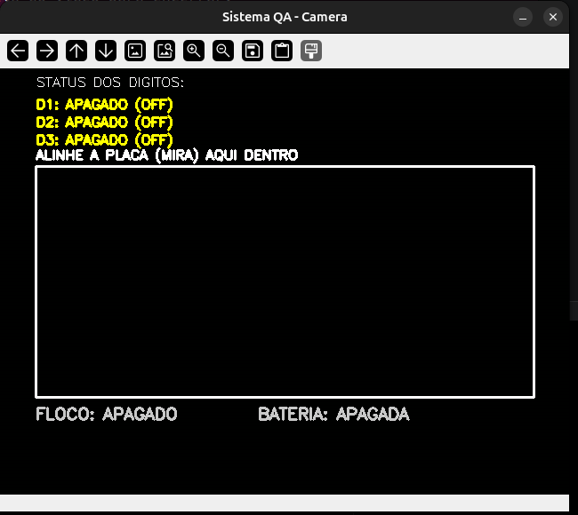
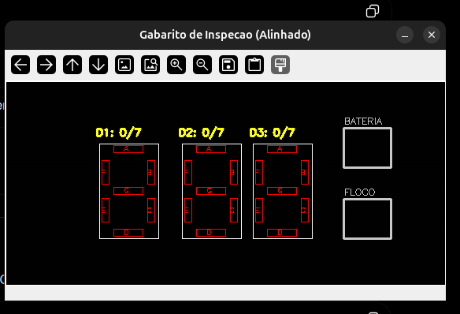
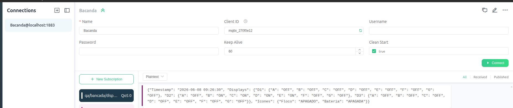

# 🔍 Inspeção Visual Automatizada com OpenCV e IoT

Projeto desenvolvido para automatizar a inspeção de displays de **7 segmentos** utilizando **Python**, **OpenCV** e o protocolo **MQTT**.

A ideia surgiu a partir de um problema comum em bancadas de teste: verificar rapidamente se todos os LEDs de um display estão funcionando sem depender apenas da inspeção visual do operador.

Com uma webcam, o sistema consegue identificar quais segmentos estão acesos, verificar os ícones do painel e enviar essas informações em tempo real pela rede utilizando MQTT.

---

# 📌 O que o sistema faz?

Durante a execução, o programa realiza automaticamente as seguintes tarefas:

* Faz a leitura de um painel com **3 displays de 7 segmentos**;
* Identifica quais segmentos estão ligados e quais estão apagados;
* Detecta os ícones de **Floco de Neve** e **Bateria**;
* Utiliza uma memória temporal de aproximadamente **4 segundos**, evitando erros causados pela multiplexação dos displays;
* Aplica um filtro morfológico para reduzir o vazamento de luz entre segmentos;
* Envia todas as informações para um broker MQTT em formato JSON.

---

# 📂 Estrutura do Projeto

```text
PROJETO_VISAO_7SEG/
│
├── images/
│   ├── sistema_qa.png
│   ├── gabarito_inspecao.png
│   └── mqttx.png
│
├── venv/
├── comunicacao_mqtt.py
├── main_inspecao.py
├── README.md
├── requirements.txt
└── .gitignore
```

---

# 🖼 Funcionamento

## Sistema em execução

<p align="center">
  
  
</p>

A janela da esquerda mostra a imagem capturada pela webcam.

Nela é possível visualizar a região onde o display deve ser posicionado para a inspeção.

Já a janela da direita apresenta o gabarito utilizado pelo algoritmo. Conforme os LEDs são detectados, cada segmento muda de estado indicando se foi reconhecido corretamente.

---

## Comunicação MQTT

<p align="center">
  
</p>

Além da inspeção visual, o sistema envia um relatório da análise para um broker MQTT. Isso permite integrar o projeto com outras aplicações, supervisórios ou sistemas industriais.

---

# ⚙️ Antes de começar

Você precisará ter instalado:

* Python 3
* Uma webcam
* Mosquitto MQTT Broker
* MQTTX

---

# 🚀 Instalando o projeto

Clone o repositório:

```bash
git clone https://github.com/SEU_USUARIO/PROJETO_VISAO_7SEG.git

cd PROJETO_VISAO_7SEG
```

---

## Criando um ambiente virtual

Dentro da pasta do projeto execute:

```bash
python -m venv venv
```

Depois ative o ambiente virtual.

### Windows

```bash
venv\Scripts\activate
```

### Linux / macOS

```bash
source venv/bin/activate
```

Se tudo der certo, o terminal ficará semelhante a:

```bash
(venv) usuario@ubuntu:~/PROJETO_VISAO_7SEG$
```

---

## Instalando as dependências

Você pode instalar tudo utilizando:

```bash
pip install -r requirements.txt
```

ou instalar manualmente:

```bash
pip install opencv-python numpy paho-mqtt
```

---

# ▶️ Executando

Com o ambiente virtual ativado e o broker MQTT em funcionamento, execute:

```bash
python main_inspecao.py
```

Ao iniciar o programa serão abertas duas janelas.

### Sistema QA - Camera

Mostra a imagem da webcam, o posicionamento do display e um resumo do estado da inspeção.

### Gabarito de Inspeção

Mostra a região onde ocorre toda a análise dos segmentos.

Os segmentos identificados são destacados automaticamente, facilitando a visualização do resultado.

Para encerrar o programa, basta clicar em qualquer janela do OpenCV e pressionar a tecla **Q**.

---

# 📡 Visualizando as mensagens no MQTTX

Abra o MQTTX e crie uma nova conexão utilizando:

| Campo    | Valor     |
| -------- | --------- |
| Host     | localhost |
| Porta    | 1883      |
| Username | vazio     |
| Password | vazio     |

Depois clique em **New Subscription** e informe o tópico:

```text
qa/bancada/display_status
```

Com o programa em execução, as mensagens começarão a aparecer automaticamente.

Exemplo:

```json
{
  "Timestamp": "2026-06-17 10:45:00",
  "Modelo_Atual": 1,
  "Inspecao": {
    "Displays": {
      "D1": {
        "A": "OFF",
        "B": "ON",
        "C": "ON",
        "D": "OFF",
        "E": "OFF",
        "F": "OFF",
        "G": "OFF"
      }
    },
    "Icones": {
      "Floco": "LIGADO",
      "Bateria": "APAGADA"
    }
  }
}
```

---

# 🧠 Como a inspeção funciona?

Em vez de analisar toda a imagem da câmera, o algoritmo trabalha apenas na região onde o display deve estar. Isso reduz o processamento e melhora o desempenho.

A imagem também é convertida para o espaço de cores HSV, o que facilita a identificação dos LEDs mesmo quando existe variação na iluminação do ambiente.

Para evitar leituras incorretas causadas pela multiplexação do display, o sistema mantém uma pequena memória temporal. Assim, se um segmento acender durante esse intervalo, ele será considerado funcionando corretamente.

Além disso, operações morfológicas ajudam a diminuir o vazamento de luz entre segmentos vizinhos.

---

# 🛠 Tecnologias utilizadas

* Python
* OpenCV
* NumPy
* Paho MQTT
* MQTT
* Processamento Digital de Imagens
* Visão Computacional

---

# 👨‍💻 Autor

**Junior Pedro**

Estudante de Engenharia de Computação.

Projeto desenvolvido como parte dos estudos em **Visão Computacional**, **IoT** e **Automação Industrial**.

---

## ⭐ Se este projeto foi útil para você

Fique à vontade para deixar uma estrela no repositório. Ela ajuda outras pessoas a encontrarem o projeto e incentiva a continuidade do desenvolvimento.
