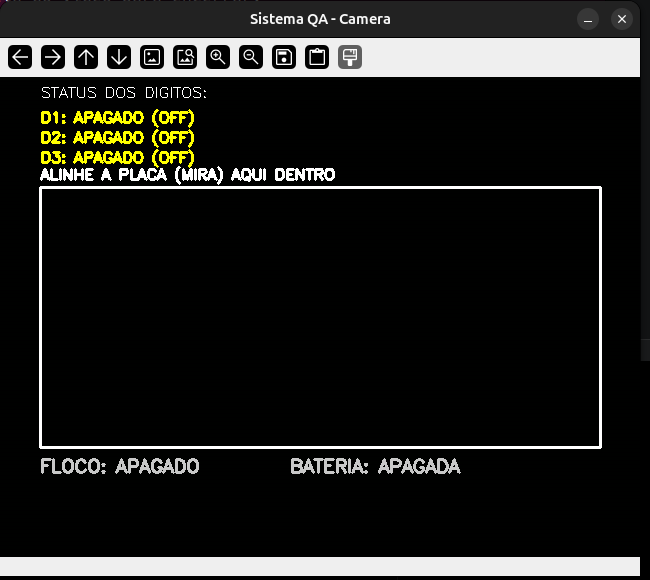
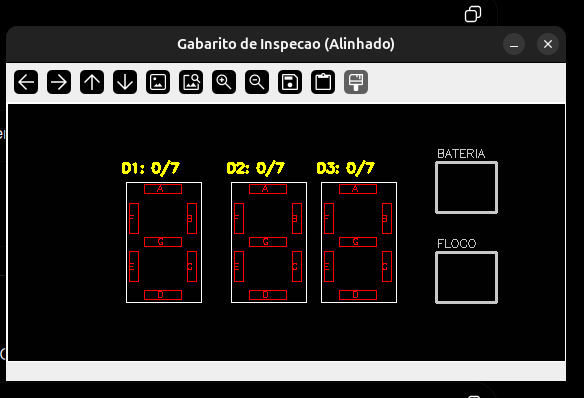
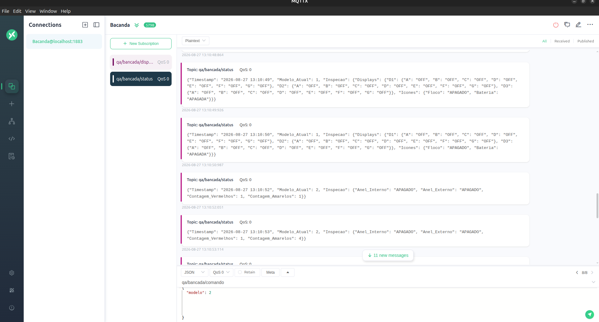

# 🔍 Sistema de Inspeção Visual com OpenCV e MQTT

Este projeto foi desenvolvido para testar uma forma de fazer **inspeção visual de placas usando uma câmera e Python 3**.

A ideia é usar visão computacional para verificar automaticamente o estado de LEDs e displays de uma placa. Depois da análise, o programa mostra o resultado na tela e também envia os dados por **MQTT**, permitindo que outro sistema utilize essas informações.

Atualmente o projeto possui **dois modelos de inspeção**:

* **Modelo 1:** painel com três displays de 7 segmentos, ícone de bateria e floco;
* **Modelo 2:** placa circular com LEDs vermelhos e amarelos.

O projeto ainda pode ser melhorado e adaptado para outros tipos de placas.

---

## 📷 Modelo 1 - Display de 7 segmentos

<p align="center">
  
</p>

No Modelo 1, a câmera fica apontada para a placa e o programa verifica três displays:

```text
D1
D2
D3
```

Cada display possui os segmentos:

```text
A B C D E F G
```

O programa verifica cada segmento separadamente e informa se ele está **ON** ou **OFF**.

Também são analisados dois indicadores:

* Floco;
* Bateria.

### Gabarito utilizado na inspeção

<p align="center">
  
</p>

O gabarito mostra as regiões que o programa está analisando.

Cada retângulo pequeno corresponde a um dos sete segmentos do display. Isso também ajuda bastante durante os testes, porque fica mais fácil entender quando uma região está fora de posição.

---

## 📷 Modelo 2 - Placa circular

Depois do primeiro modelo, também foi adicionada uma segunda forma de inspeção para uma placa circular.

<p align="center">
  
</p>

Nesse modelo o programa procura LEDs de duas cores:

* LEDs vermelhos;
* LEDs amarelos.

Os LEDs vermelhos são usados para verificar o anel interno e os amarelos para o anel externo.

Além de mostrar o resultado na tela, o programa também conta quantos LEDs de cada cor foram encontrados.

---

# 🧠 Como funciona

O programa usa principalmente o **OpenCV** para capturar e processar a imagem da câmera.

De forma resumida, o funcionamento é:

```text
Câmera
   ↓
Captura da imagem
   ↓
Processamento com OpenCV
   ↓
Separação das cores
   ↓
Análise dos LEDs
   ↓
Resultado da inspeção
   ↓
Envio dos dados por MQTT
```

Para facilitar a identificação das cores, a imagem capturada pela câmera é convertida para o espaço de cores **HSV**.

Também são usadas regiões específicas da imagem, chamadas de **ROI (Region of Interest)**. Assim, o programa não precisa analisar todos os pixels da câmera para descobrir o estado de cada segmento.

---

# 📂 Estrutura do projeto

Depois de clonar o repositório, a estrutura principal será parecida com esta:

```text
projeto-visao-7seg/
│
├── images/
│   ├── gabarito_inspecao.png
│   ├── mqttx.png
│   ├── sistema_circular_modelo_2.png
│   └── sistema_qa.png
│
├── comunicacao_mqtt.py
├── main_inspecao.py
├── requirements.txt
├── README.md
└── .gitignore
```

### `main_inspecao.py`

É o arquivo principal do projeto.

Nele estão:

* configuração da câmera;
* processamento das imagens;
* regiões de interesse;
* identificação das cores;
* inspeção dos displays;
* inspeção da placa circular;
* interface mostrada pelo OpenCV.

### `comunicacao_mqtt.py`

Esse arquivo cuida da parte de MQTT.

Ele é responsável por:

* conectar ao broker;
* publicar os resultados;
* receber comandos;
* controlar qual modelo está sendo usado.

### `requirements.txt`

Contém as bibliotecas Python necessárias para executar o projeto.

---

# 🛠️ Tecnologias utilizadas

Foram utilizadas:

* Python 3;
* OpenCV;
* NumPy;
* Paho MQTT;
* Mosquitto;
* MQTTX.

---

# ⚙️ Antes de começar

Para rodar o projeto é necessário ter:

* Python 3;
* pip;
* Git;
* uma câmera;
* Mosquitto MQTT Broker.

O MQTTX não é obrigatório, mas ajuda bastante para testar e visualizar as mensagens MQTT.

---

# 🚀 Baixando o projeto

Primeiro clone o repositório:

```bash
git clone https://github.com/CoJunior/projeto-visao-7seg.git
```

Entre na pasta:

```bash
cd projeto-visao-7seg
```

---

# 🐍 Criando o ambiente virtual

É recomendado usar um ambiente virtual para instalar as bibliotecas do projeto sem misturar com outros projetos Python.

No Linux:

```bash
python3 -m venv venv
```

Ative com:

```bash
source venv/bin/activate
```

Quando estiver ativado, normalmente aparece `(venv)` no começo da linha do terminal.

Exemplo:

```text
(venv) usuario@computador:~/projeto-visao-7seg$
```

Para sair do ambiente virtual depois:

```bash
deactivate
```

---

# 📦 Instalando as bibliotecas

Com o ambiente virtual ativado:

```bash
python3 -m pip install -r requirements.txt
```

O arquivo instala as principais dependências do projeto:

```text
opencv-python
numpy
paho-mqtt
```

---

# 📷 Configuração da câmera

No começo do arquivo `main_inspecao.py` existe:

```python
CAMERA_INDEX = 1
```

Esse número indica qual câmera será usada.

Dependendo do computador pode ser necessário trocar para:

```python
CAMERA_INDEX = 0
```

Se tiver mais de uma câmera conectada, também pode ser necessário testar `1`, `2` etc.

No Linux é possível verificar as câmeras encontradas usando:

```bash
ls /dev/video*
```

---

# 📡 MQTT

O projeto usa MQTT para enviar o resultado da inspeção.

Por padrão o broker está configurado como:

```text
Host: localhost
Porta: 1883
```

Isso significa que o Mosquitto deve estar rodando no mesmo computador.

---

## Iniciando o Mosquitto

No Ubuntu/Linux:

```bash
sudo systemctl start mosquitto
```

Para verificar:

```bash
sudo systemctl status mosquitto
```

Se estiver funcionando deve aparecer:

```text
Active: active (running)
```

Pressione `q` para sair da tela do status.

---

## Parando o Mosquitto

Quando não quiser mais deixar o broker rodando:

```bash
sudo systemctl stop mosquitto
```

Para conferir:

```bash
sudo systemctl status mosquitto
```

Nesse caso deverá aparecer:

```text
Active: inactive (dead)
```

---

# ▶️ Rodando o projeto

Entre na pasta do projeto, caso ainda não esteja nela:

```bash
cd projeto-visao-7seg
```

Ative o ambiente:

```bash
source venv/bin/activate
```

Inicie o Mosquitto:

```bash
sudo systemctl start mosquitto
```

Agora execute:

```bash
python3 main_inspecao.py
```

O programa deverá abrir a janela da câmera e começar a fazer a inspeção.

Para fechar o programa, selecione a janela do OpenCV e pressione:

```text
q
```

---

# 📡 Testando com MQTTX

O MQTTX pode ser usado para acompanhar os dados enviados pelo programa.

<p align="center">
  
</p>

Para conectar localmente:

| Campo    | Valor        |
| -------- | ------------ |
| Name     | Bancada      |
| Host     | localhost    |
| Port     | 1883         |
| Username | deixar vazio |
| Password | deixar vazio |

Depois clique em **Connect**.

---

# 📬 Tópicos MQTT

O projeto utiliza dois tópicos principais.

### Resultado da inspeção

```text
qa/bancada/status
```

É nesse tópico que o Python publica os resultados.

No MQTTX basta criar uma inscrição (`New Subscription`) para:

```text
qa/bancada/status
```

### Comandos

```text
qa/bancada/comando
```

Esse tópico é usado para mandar comandos para o programa.

Atualmente ele é usado principalmente para trocar entre os dois modelos.

---

# 🔄 Trocando o modelo pelo MQTTX

O programa começa no **Modelo 1**.

Para selecionar o Modelo 1 pelo MQTT, publique no tópico:

```text
qa/bancada/comando
```

o JSON:

```json
{
  "modelo": 1
}
```

Para mudar para o Modelo 2:

```json
{
  "modelo": 2
}
```

Não é necessário fechar o programa para fazer a troca.

---

# 📤 Dados enviados

As mensagens são enviadas em formato JSON.

No Modelo 1, um exemplo simplificado é:

```json
{
  "Timestamp": "2026-07-01 17:22:31",
  "Modelo_Atual": 1,
  "Inspecao": {
    "Displays": {
      "D1": {
        "A": "OFF",
        "B": "ON",
        "C": "ON",
        "D": "OFF",
        "E": "OFF",
        "F": "ON",
        "G": "ON"
      }
    },
    "Icones": {
      "Floco": "APAGADO",
      "Bateria": "LIGADA"
    }
  }
}
```

No Modelo 2 são enviados o estado dos anéis e a quantidade de LEDs encontrados:

```json
{
  "Timestamp": "2026-07-01 17:22:31",
  "Modelo_Atual": 2,
  "Inspecao": {
    "Anel_Interno": "LIGADO",
    "Anel_Externo": "LIGADO",
    "Contagem_Vermelhos": 3,
    "Contagem_Amarelos": 9
  }
}
```

---

# 🎛️ Ajustes importantes

Como o projeto trabalha com câmera e cores, alguns valores podem precisar ser ajustados dependendo do ambiente.

No `main_inspecao.py` existem configurações como:

```python
CAMERA_INDEX = 1
CAM_WIDTH = 640
CAM_HEIGHT = 480
```

Também existem valores para as faixas HSV e para os limites usados na detecção.

Se a câmera mudar ou a iluminação estiver muito diferente, pode ser necessário recalibrar esses valores.

---

# ❗ Alguns problemas que podem acontecer

### A câmera não abre

Tente mudar:

```python
CAMERA_INDEX = 1
```

para:

```python
CAMERA_INDEX = 0
```

Depois rode novamente.

---

### Erro `No module named cv2`

Provavelmente as dependências não foram instaladas ou o ambiente virtual não está ativo.

Ative:

```bash
source venv/bin/activate
```

Depois:

```bash
python3 -m pip install -r requirements.txt
```

---

### MQTTX mostra `ECONNREFUSED`

Verifique se o Mosquitto está rodando:

```bash
sudo systemctl status mosquitto
```

Se aparecer:

```text
inactive (dead)
```

inicie:

```bash
sudo systemctl start mosquitto
```

Depois tente conectar novamente no MQTTX.

---

### Os LEDs não estão sendo detectados corretamente

Algumas coisas podem influenciar:

* iluminação do ambiente;
* distância da câmera;
* posição da placa;
* reflexos;
* faixa HSV;
* posição das ROIs.

No Modelo 1 é importante tentar manter a placa alinhada com o retângulo mostrado na tela.

---

# 🔧 Continuando o projeto

Quem quiser modificar a parte de visão computacional deve começar pelo:

```text
main_inspecao.py
```

Para mexer na comunicação MQTT:

```text
comunicacao_mqtt.py
```

A estrutura também permite adicionar outros modelos no futuro.

Por exemplo:

```text
Modelo 1 → Displays de 7 segmentos
Modelo 2 → Placa circular
Modelo 3 → Outro tipo de placa
```

Para isso será necessário criar a lógica de inspeção do novo modelo e adicionar o novo número na parte que recebe os comandos MQTT.

---

# 📝 Observação

Este projeto ainda está em desenvolvimento e foi feito principalmente para estudar e testar conceitos de **visão computacional, processamento de imagens e comunicação MQTT**.

Alguns parâmetros ainda são específicos para as placas e para a câmera usadas durante os testes. Por isso, quem utilizar outra câmera ou outro tipo de placa provavelmente terá que ajustar as regiões de interesse e os valores de cor.

---

# 👨‍💻 Autor

**Junior Co**

Estudante de Engenharia de Computação.
